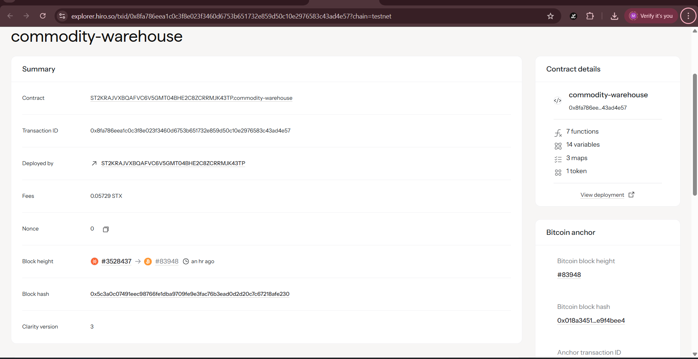

# Commodity Warehouse

## Project Description

The Commodity Warehouse project revolutionizes commodity trading by tokenizing physical commodities through blockchain-based warehouse receipts. This smart contract system creates liquid markets for precious metals like gold, energy commodities like oil, and agricultural products like grains by issuing fungible tokens backed by verified physical assets stored in certified warehouses.

The platform bridges the gap between traditional commodity storage and modern DeFi markets, enabling fractional ownership, instant settlements, and global accessibility to commodity investments. Each warehouse receipt represents verified physical commodities, ensuring that every token is backed by real-world assets.

## Project Vision

Our vision is to democratize access to commodity markets by creating a transparent, efficient, and liquid trading ecosystem. We aim to:

- **Eliminate Traditional Barriers**: Remove geographical limitations, high minimum investments, and complex logistics that prevent retail investors from accessing commodity markets
- **Enhance Market Liquidity**: Create 24/7 global markets where commodities can be traded instantly without physical delivery constraints
- **Ensure Transparency**: Provide immutable records of commodity ownership, storage locations, and transaction history on the blockchain
- **Enable Financial Innovation**: Allow commodity-backed tokens to be integrated into DeFi protocols for lending, borrowing, and yield farming
- **Standardize Global Trade**: Create uniform standards for commodity tokenization that can be adopted worldwide

## Future Scope

### Phase 1: Core Infrastructure
- Integration with certified warehouse partners globally
- Real-time commodity price oracles
- Mobile application for retail investors
- Multi-signature wallet support for institutional clients

### Phase 2: Advanced Features
- **Cross-Chain Compatibility**: Deploy on multiple blockchains (Ethereum, Polygon, BSC) for broader market access
- **Fractional Ownership**: Enable ownership of commodity fractions as small as 1 gram of gold or 1 barrel of oil
- **Automated Market Making**: Implement AMM pools for instant commodity swaps
- **Yield Farming**: Allow users to earn yields by providing liquidity to commodity pools

### Phase 3: Ecosystem Expansion
- **Insurance Integration**: Partner with insurance providers to cover stored commodities
- **Supply Chain Tracking**: Implement IoT sensors for real-time monitoring of stored commodities
- **Regulatory Compliance**: Obtain necessary licenses for operating in major financial jurisdictions
- **AI-Powered Analytics**: Provide market insights and price predictions using machine learning

### Phase 4: Global Integration
- **Central Bank Partnerships**: Work with central banks for sovereign commodity reserves
- **Enterprise Solutions**: Develop B2B platforms for large-scale commodity traders
- **Educational Platform**: Launch academy for commodity trading education
- **Carbon Credits**: Expand to environmental commodities and carbon offset markets

### Long-term Vision
- Become the leading global infrastructure for commodity tokenization
- Process over $100 billion in commodity trades annually
- Partner with 1000+ certified warehouses worldwide
- Serve 10 million+ retail and institutional investors

## Contract Address Details

 ST2KRAJVXBQAFVC6V5GMT04BHE2C8ZCRRMJK43TP.commodity-warehouse
 
 
### Testnet Deployment
- **Network**:
- **Contract Address** 
- **Transaction Hash**
- **Deployment Date**

### Mainnet Deployment
- **Network**
- **Contract Address**
- **Transaction Hash**
- **Deployment Date**

### Supported Commodities
- **Gold (Type 1)**: Precious metal storage and trading
- **Oil (Type 2)**: Energy commodity futures and storage
- **Grain (Type 3)**: Agricultural commodity storage and trading

### Key Functions
1. **deposit-commodity**: Deposit physical commodities and receive warehouse receipts
2. **withdraw-commodity**: Withdraw physical commodities using valid warehouse receipts

---

*For technical documentation, API references, and integration guides, please refer to our developer documentation.*

